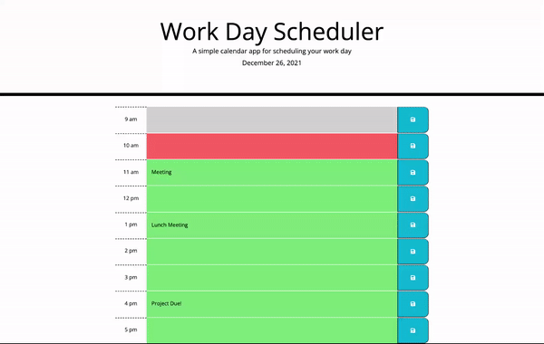

# Work Day Scheduler

## Description

This daily Planner application can be used to organize events for your busy work day! when you load the page, the current date is displayed on top. A box for each hour between 9am and 5pm is shown, color coded based on the current hour (hours that have passed ar grey, the current hour is red, and future hours are green). When the user clicks a time block, it becomes a text-box where the user can enter information for that hour. There is a save button to the right of each row that allows the user to save their input. Information saves to local storage, so that it persists through page reloads. 

[Link to the webpage of the deployed application](https://danidelia253.github.io/work-day-scheduler/)

[Project Repository](https://github.com/DaniDelia253/work-day-scheduler)

---

## Table of Contents

* [Usage](#usage)
* [Credits](#credits)

---

## Usage

---

## Credits

User Story, Mock Up, snd Starter Code provided by Trinity Education Sercice © 2021 Trilogy Education Services, LLC, a 2U, Inc. brand. Confidential and Proprietary. All Rights Reserved.

[Project Repository](https://github.com/DaniDelia253/code-quiz)

---